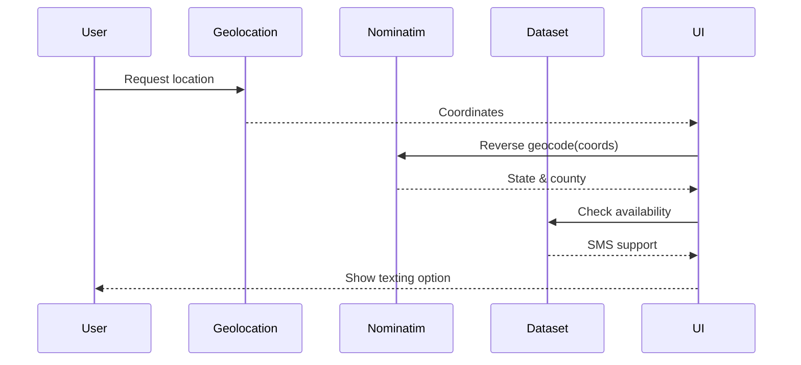

# System Design Document for iKey App

## 1. Overview
The iKey app is a browser-based emergency information manager that lets users create a secure QR code containing medical and contact details. It provides modules for storing health records, bookmarking locations, adjusting text size for accessibility, managing session security, and accessing location-based 911 assistance with SMS availability checks. All data is stored client-side with strong encryption, enabling offline use and enhancing privacy.

## 2. High-Level Architecture

The application runs entirely in the browser. `index.html` orchestrates loading of JavaScript modules and embeds two auxiliary pages: `health-records.html` for viewing medical files and `text-911.html` for location-enabled texting to emergency services.

## 3. Components
### 3.1 Core Logic (app.js)
* `ThreeLayerEncryption` implements key generation, hashing, and AES-GCM encryption for QR payloads, profile data, and the double-wrapped vault that holds health records.
* `UnifiedHealthApp` manages the personal health vault, handles attachment creation/import/export, and exposes a global instance for UI modules.
* Location bookmarking and geolocated notes use device GPS or manual entry, with category tags and Google Maps embeds.

### 3.2 Medication Search (medication.js)
* `MedicationSearch` queries the DrugBank API to autocomplete medication names and display dosage details.
* `AllergyChecker` evaluates selected medications against a list of common allergens and user-entered allergies.

### 3.3 Session Management (session.js)
* `SessionManager` tracks inactivity, shows warnings, autosaves form drafts to `localStorage`, and optionally archives drafts to the Wayback Machine.
* It presents a countdown ring and modal dialogs to extend or end sessions.

### 3.4 Text Size Controller (text-size.js)
* Provides accessible font scaling across the main document and embedded iframes.
* Persists user selection in `localStorage` and synchronizes across tabs via the `storage` event.

### 3.5 Emergency Text Helper (text-911.html)
* Obtains device coordinates and reverse geocodes via Nominatim.
* Cross-references a local `911-texting.json` dataset to indicate whether SMS to 911 is supported in the current county.
* Prepares a pre-filled SMS message with location details and opens the user's texting app if service is available.

## 4. Data Model
### 4.1 Encrypted Record Structure
```json
{
  "guid": "<uuid>",
  "qrKey": "<base64>",
  "storedData": {
    "publicData": { "iv": "...", "data": "..." },
    "privateInfo": { "encryptedWith": "<sha256(qrKey+password)>", ... },
    "vault": { "iv": "...", "data": "...", "salt": "<base64>" }
  }
}
```
* `publicData` – emergency info encrypted directly with `qrKey`.
* `privateInfo` – profile fields gated by a SHA-256 hash of `qrKey` + password.
* `vault` – health records encrypted with a key derived from `qrKey` and random salt using PBKDF2.

### 4.2 Local Storage Keys
* `sessionExpiration`, `sessionDuration` – timers for session security.
* `sessionDraft` – autosaved form data for recovery.
* `ikey_text_size` – user’s preferred font scale.
* `ikey.places.draft` – cached location notes.
* `ikey_preferred_language` – UI language preference.

### 4.3 Text 911 Dataset
* `911-texting.json` – static list of U.S. PSAPs and counties offering SMS-to-911 service; used offline by the emergency text helper.

## 5. Data Flow
### 5.1 QR Record Creation

### 5.2 Session Handling


### 5.3 Text 911 Lookup


## 6. External Services & APIs
* **DrugBank API** – medication autocomplete and metadata retrieval.
* **Geolocation API** – obtains device coordinates for location features.
* **OpenStreetMap Nominatim** – reverse geocodes coordinates and finds cross streets in the text-911 helper.
* **Google Maps** – provides map embeds and links for saved locations.
* **WebCrypto** – all cryptographic operations (key derivation, hashing, AES-GCM).
* **Wayback Machine** – optional archival storage via `sendBeacon`.

## 7. Security Considerations
* All encryption occurs in the browser using ephemeral keys; nothing is transmitted unless the user explicitly shares data.
* The QR key is random 256-bit and never stored server-side.
* Session timeouts and idle warnings reduce exposure on shared devices.
* Autosaved drafts reside locally and can be purged on logout or session expiry.

## 8. Scalability & Deployment
* **Client-Side Scaling** – Because logic runs in the browser and data is local, scaling to many users primarily depends on delivering static assets via a CDN.
* **External API Limits** – DrugBank calls should be rate-limited and cached to handle high volume.
* **Offline Capability** – Critical flows (QR creation, health records) function offline once assets are cached, reducing server load.

## 9. Future Enhancements
* Implement service worker caching and background sync.
* Introduce configurable encryption parameters to support alternative algorithms.
* Provide optional cloud backup using end-to-end encryption.

